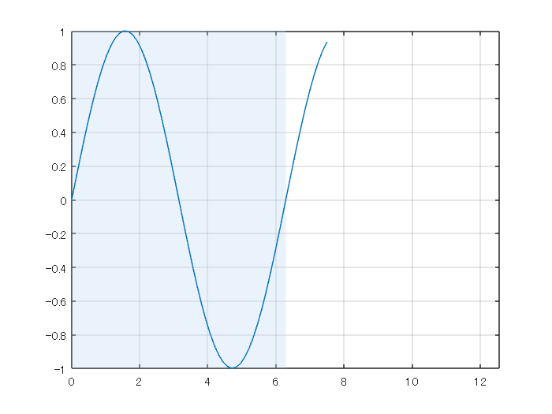
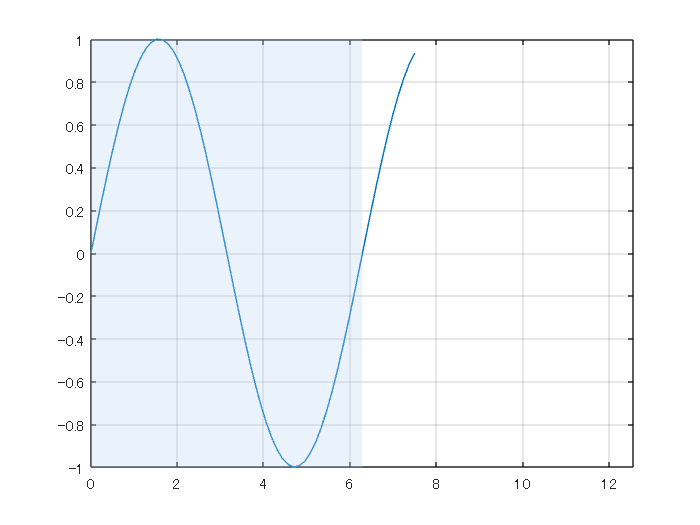
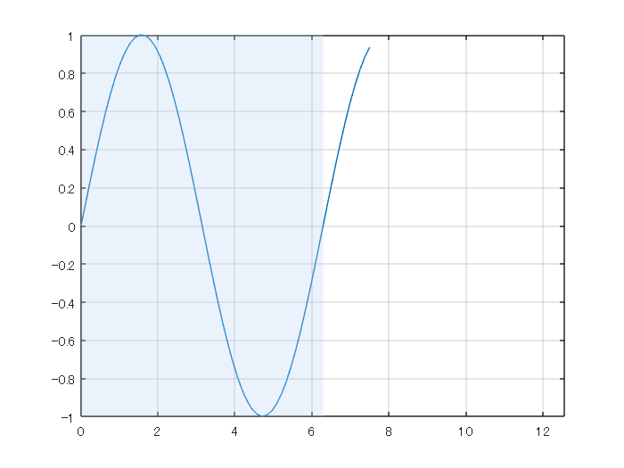
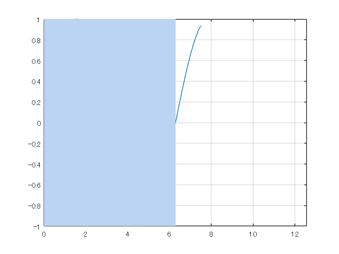
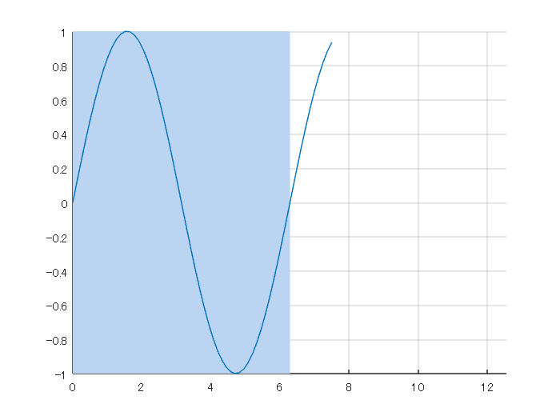
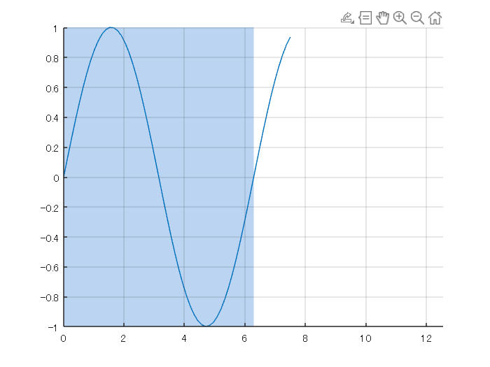

# `グラフ背景色の追加方法比較（area, rectangle, annotation, xregion）`

Copyright (c) 2023 Michio Inoue

# やったこと

   -  グラフに背景色追加する方法の比較 


MATLAB のグラフィックスオブジェクト周りの知識が必要ですが、その辺は以下のページがお勧めです。

   -  [Qiita: MATLAB でゲームを作る ～0. グラフィックス オブジェクト編～](https://qiita.com/macht/items/05e848f2fa9fab0a538e) 
   -  [公式ページ：グラフィックス オブジェクト](https://jp.mathworks.com/help/matlab/graphics-objects.html?s_eid=PSM_29435) 

  
# 環境

MATLAB R2023a (xregion 以外は R2022b 以前でも動きます)

# **背景の追加方法の一覧**

背景色として例えば薄い青を追加する場合、知る限りでは以下の 4 つの方法があります（他にもあれば教えてください）。

   -  [annotation 関数](https://jp.mathworks.com/help/matlab/ref/annotation.html) で四角形を描画 
   -  [area 関数](https://jp.mathworks.com/help/matlab/ref/area.html) で描画 
   -  [rectangle 関数](https://jp.mathworks.com/help/matlab/ref/rectangle.html) で描画 
   -  [xregion 関数](https://jp.mathworks.com/help/matlab/ref/xregion.html) で描画 

個人的には R2022b まで annotation 関数を使っていましたが、R2023a からは xregion (or yregion) 関数がおススメです。

xregion 関数以外の欠点（ややこしいところ）は

   -  annotation 関数：描画領域の指定が Figure オブジェクト内での相対位置（プロットに現れる値が直接使えない） 
   -  area 関数：描画の順番が影響する（plot の後に実行するとそのままでは線が隠れてしまうが、FaceAlpha があるのでまぁ大丈夫） 
   -  rectangle 関数：area 関数と同じだが、FaceAlpha がないので描画順番が超重要 

ということでそれぞれの困るところがある状況です。

参考までそれぞれ作成されるオブジェクトのプロパティ一覧へのリンクを張っておきます。

   -  [Annotation で作成される四角形オブジェクト](https://jp.mathworks.com/help/matlab/ref/matlab.graphics.shape.rectangle-properties.html)（matlab.graphics.shape.Rectangle） 
   -  [Area オブジェクトのプロパティ](https://jp.mathworks.com/help/matlab/ref/matlab.graphics.chart.primitive.area-properties.html) (matlab.graphics.chart.primitive.Area) 
   -  [Rectangle オブジェクトのプロパティ](https://jp.mathworks.com/help/matlab/ref/matlab.graphics.primitive.rectangle-properties.html) (matlab.graphics.primitive.Rectangle) 
   -  [xregion で作成されるオブジェクトのプロパティ](https://jp.mathworks.com/help/matlab/ref/matlab.graphics.chart.decoration.constantregion-properties.html)(matlab.graphics.chart.decoration.ConstantRegion) 

annotation 関数で作る四角形と rectangle 関数でつくる四角形は違うんですよね・・。

# xregion 関数 (ConstantRegion オブジェクト）

さて、まずはこれ。

透明度を指定する FaceAlpha は既定値で 0.3 に設定されています。基本的には色と表示範囲を指定するだけの簡単仕様。hold on も不要。

```matlab:Code
N = 100;
x = linspace(0,4*pi,N);
y = sin(x);
plot(x(1:N/2+10),y(1:N/2+10)); % 0 => 2*piちょっとプロット

xmin = 0;
xmax = 4*pi;
xmax_plot = 2*pi;
axis([xmin,xmax,-1,1]) % 表示範囲は 0 -> 4*pi
grid on

if ~isMATLABReleaseOlderThan("R2023a")
    handle_xregion = xregion(xmin, xmax_plot,...
        'FaceColor',[0.73 0.83 0.95]); % 薄青
end
```



いいですね。

ちなみにオブジェクトはこれ

```matlab:Code
handle_xregion
```

```text:Output
handle_xregion = 
  ConstantRegion のプロパティ:

    InterceptAxis: 'x'
            Value: [0 6.283185307179586]
        FaceColor: [0.730000000000000 0.830000000000000 0.950000000000000]
        LineStyle: '-'
        LineWidth: 0.500000000000000

  すべてのプロパティ を表示

```

# annotation 関数（Rectangle オブジェクト）

グラフに注釈をつけるためのオブジェクトです。楕円文字、矢印やらいろいろ付け加えられますが、単純な四角形も行けます。ただ、大きな欠点として Annotation オブジェクトの位置・サイズきめがややこしい。詳細はこちら「[グラフ背景色をデータの追加とともに変化させるアニメーション作成](https://qiita.com/eigs/items/51194d8232d0ceb68d6b)」を参照ください。

やってみます。

```matlab:Code
N = 100;
x = linspace(0,4*pi,N);
y = sin(x);
plot(x(1:N/2+10),y(1:N/2+10)); % 0 => 2*piちょっとプロット

xmin = 0;
xmax = 4*pi;
xmax_plot = 2*pi;
axis([xmin,xmax,-1,1]) % 表示範囲は 0 -> 4*pi
grid on

handle_axes = gca; % 座標軸オブジェクトのハンドル確保
pos = handle_axes.Position; % 座標軸オブジェクトの位置、サイズ情報を確保

xleft = pos(1); % 左端の位置
wleft = pos(3)/(xmax - xmin).*(xmax_plot-xmin); % x軸方向の大きさ

handle_annotation = annotation('rectangle',...
    [xleft pos(2) wleft pos(4)],...
    'EdgeColor','none',... % エッジの色（境界線）は無し
    'FaceColor',[0.73 0.83 0.95],... % 薄青
    'FaceAlpha',0.3); % 透明度
```



かなりややこしい。

ちなみにオブジェクトはこれ

```matlab:Code
handle_annotation
```

```text:Output
handle_annotation = 
  Rectangle のプロパティ:

        Color: [0 0 0]
    FaceColor: [0.730000000000000 0.830000000000000 0.950000000000000]
    LineStyle: '-'
    LineWidth: 0.500000000000000
     Position: [0.130000000000000 0.110000000000000 0.387500000000000 0.815000000000000]
        Units: 'normalized'

  すべてのプロパティ を表示

```

# area 関数 (Area オブジェクト）

さて次。こちらは本来データの下を塗りつぶす関数です（[ヘルプページ](https://jp.mathworks.com/help/matlab/ref/area.html)）ので描画位置の指定が X, Y で指定して、ベースライン（描画の下限）は別途指定する必要があります。指定しない場合は 0 がベースになります。

すなおに行くとこんな感じ（hold on しないと上書きされちゃいますので要注意）

```matlab:Code
figure
N = 100;
x = linspace(0,4*pi,N);
y = sin(x);
plot(x(1:N/2+10),y(1:N/2+10)); % 0 => 2*piちょっとプロット

xmin = 0;
xmax = 4*pi;
xmax_plot = 2*pi;
axis([xmin,xmax,-1,1]) % 表示範囲は 0 -> 4*pi
grid on

hold on
baseline = -1; % 四角形の下辺の y 座標
handle_area = area([xmin,xmax_plot],[1,1], baseline, ...
'FaceColor',[0.73 0.83 0.95],... % 薄青
'FaceAlpha', 0.3, ... % 透明度
'EdgeColor','none'); % エッジの色（境界線）は無し
hold off
```



イイ感じ。

ただ透明度を下げると線が隠れちゃうので、色によっては area オブジェクトを先に描く方がおススメです。

ちなみにオブジェクトはこれ

```matlab:Code
handle_area
```

```text:Output
handle_area = 
  Area のプロパティ:

    FaceColor: [0.730000000000000 0.830000000000000 0.950000000000000]
    EdgeColor: 'none'
    LineStyle: '-'
    LineWidth: 0.500000000000000
    BaseValue: -1
        XData: [0 6.283185307179586]
        YData: [1 1]

  すべてのプロパティ を表示

```

# rectangle 関数（Rectangle オブジェクト）

最後に rectangle 関数でやってみます。FaceAlpha (透明度) は指定不可です。残念。

すなおに行くとこんな感じ（これも hold on しないと上書きされちゃいますので要注意）

```matlab:Code
figure
N = 100;
x = linspace(0,4*pi,N);
y = sin(x);
plot(x(1:N/2+10),y(1:N/2+10)); % 0 => 2*piちょっとプロット

xmin = 0;
xmax = 4*pi;
xmax_plot = 2*pi;
axis([xmin,xmax,-1,1]) % 表示範囲は 0 -> 4*pi
grid on

hold on
handle_rectangle = rectangle('Position',[0,-1,xmax_plot,2], ...
'FaceColor',[0.73 0.83 0.95],... % 薄青
'EdgeColor','none'); % エッジの色（境界線）は無し
% FaceAlpha (透明度) は指定不可
hold off
```



主張が激しい。プロットの線もグリッド線も一緒に隠れています。

描く順番を変えて、rectangle を先に実行します。

```matlab:Code
figure
N = 100;
x = linspace(0,4*pi,N);
y = sin(x);

xmin = 0;
xmax = 4*pi;
xmax_plot = 2*pi;

handle_rectangle = rectangle('Position',[0,-1,xmax_plot,2], ...
'FaceColor',[0.73 0.83 0.95],... % 薄青
'EdgeColor','none');
hold on
plot(x(1:N/2+10),y(1:N/2+10)); % 0 => 2*piちょっとプロット
axis([xmin,xmax,-1,1]) % 表示範囲は 0 -> 4*pi
grid on
hold off
```



グリッド線は消えたまま。ここを変えるには axes オブジェクトの Layer を top にすればよし。

```matlab:Code(Display)
handle_axes.Layer = 'top';
```

やり直します。

```matlab:Code
figure
N = 100;
x = linspace(0,4*pi,N);
y = sin(x);

xmin = 0;
xmax = 4*pi;
xmax_plot = 2*pi;

handle_axes = gca; % current axes
handle_axes.Layer = 'top';

handle_rectangle = rectangle('Position',[0,-1,xmax_plot,2], ...
'FaceColor',[0.73 0.83 0.95],... % 薄青
'EdgeColor','none');
hold on

plot(x(1:N/2+10),y(1:N/2+10)); % 0 => 2*piちょっとプロット
axis([xmin,xmax,-1,1]) % 表示範囲は 0 -> 4*pi
grid on
hold off
```



# まとめ

薄い青色の背景色を追加する方法として 4 つの方法を試してみました。

   -  [annotation 関数](https://jp.mathworks.com/help/matlab/ref/annotation.html) で四角形を描画 
   -  [area 関数](https://jp.mathworks.com/help/matlab/ref/area.html) で描画 
   -  [rectangle 関数](https://jp.mathworks.com/help/matlab/ref/rectangle.html) で描画 
   -  [xregion 関数](https://jp.mathworks.com/help/matlab/ref/xregion.html) で描画 

結論としては xregion 関数が楽でよい。ということで、他の関数で苦労していた方もそうでない方も、[xregion 関数](https://jp.mathworks.com/help/matlab/ref/xregion.html)（[yregion 関数](https://jp.mathworks.com/help/matlab/ref/yregion.html)もあります）を試してみてください。
