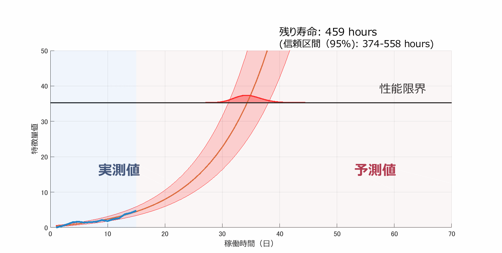
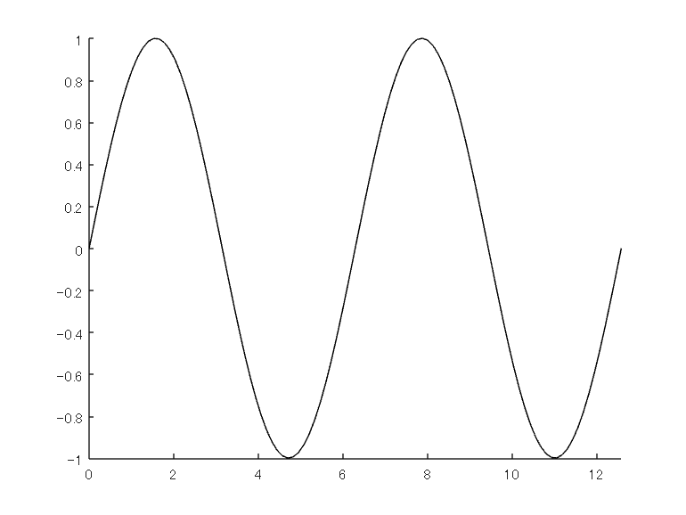
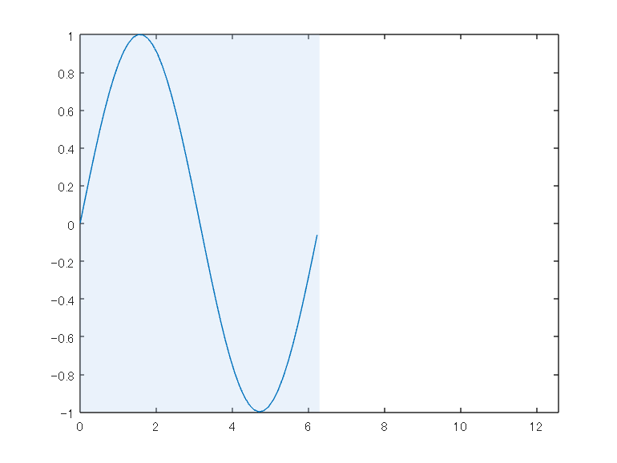
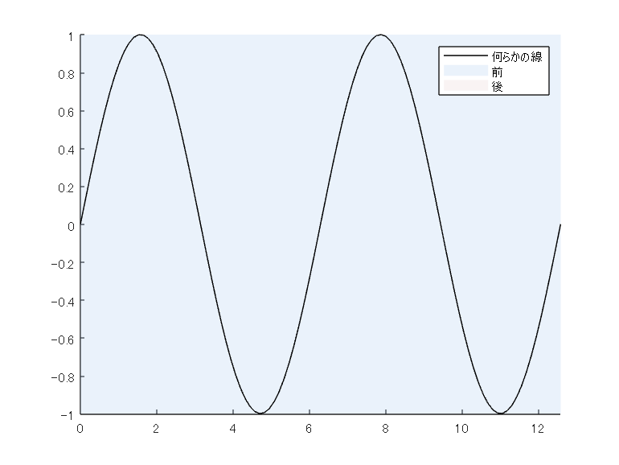

# 「グラフ背景色をデータの追加とともに変化させるアニメーション作成」を R2023a の xregion 関数でシンプルに
[](https://jp.mathworks.com/matlabcentral/fileexchange/127104-animation-with-moving-background)
[](https://matlab.mathworks.com/open/github/v1?repo=minoue-xx/Animation-with-moving-background&file=./README.mlx)

Copyright (c) 2023 Michio Inoue

# やったこと

   -  データに合わせた動的な背景描画（[xregion 関数](https://jp.mathworks.com/help/matlab/ref/xregion.html)） 
   -  gif ファイル作成（[exportgraphics 関数](https://jp.mathworks.com/help/matlab/ref/exportgraphics.html#mw_0216309c-493a-43ac-908a-6ad656b1fc82)） 

以前書いた「[グラフ背景色をデータの追加とともに変化させるアニメーション作成](https://qiita.com/eigs/items/51194d8232d0ceb68d6b)」を R2023a で導入された [xregion 関数](https://jp.mathworks.com/help/matlab/ref/xregion.html)を使って書き直しました。コードも短く、超楽になりました！

ついでに GIF アニメ―ションも [exportgraphics 関数](https://jp.mathworks.com/help/matlab/ref/exportgraphics.html#mw_0216309c-493a-43ac-908a-6ad656b1fc82)で "Append" オプション指定で実現できるようになっている（R2022a から）のでこちらも活用します。

## 目次

   -  はじめに 
   -  アニメーション（gif 作成） 
   -  背景の追加 
   -  背景追加+更新を行う関数作成 
   -  そして最終形 

# はじめに

[元投稿](https://qiita.com/eigs/items/51194d8232d0ceb68d6b)と同じ書き出しになりますが（笑）きっかけはこのグラフ。



ある値が閾値（性能限界）を超えるまでの時間を予測したもの。線上を動く山はその確率分布です。予測の手法詳細ついてはこちら：Residual-life distributions from component degradation signals: A Bayesian approach (N Gebraeel, 2005)

予測モデル自体は関数が実装されているのでいいんですが、R2023a より前のバージョンでとても手間がかかったのは青い線ともに変化する、薄い赤青の背景でしたが R2023a の [xregion 関数](https://jp.mathworks.com/help/matlab/ref/xregion.html) で超楽になったので、その違いを紹介します。

  
## 環境

MATLAB R2023a

以降、アニメーション作成と、背景描画に分けて紹介します。

# 1. アニメーション（gif 作成）

まずはアニメーション作成。exportgraphics 関数を使用します。

ループで新規データを追加してアニメーションを作成するのに [Animatedlineオブジェクト](https://jp.mathworks.com/help/matlab/ref/animatedline.html?s_eid=PSM_29435) を使い、データの追加には addpoints を使用。以下のコードはリンク先にあるサンプルコードに GIFファイルへの出力を加えたものです。

```matlab:Code
close
N = 100;
x = linspace(0,4*pi,N);
y = sin(x);

filename = 'animation_sample.gif'; % Specify the output file name
if exist(filename,'file')
    delete(filename)
end

h = animatedline;
axis([0,4*pi,-1,1]) % x軸の表示範囲を固定

for k = 1:length(x)
    addpoints(h,x(k),y(k)); % ループでデータを追加
    exportgraphics(gca,filename,"Append",true)
end
```



こんな感じ。

exportgraphics 関数自体は R2020a から使えますが、 "Append" オプションが入ったのは R2022a。R2021b 以前のバージョンだと、ループ内はこんな感じになります。

```matlab:Code(Display)
for k = 1:length(x)
    addpoints(h,x(k),y(k)); % ループでデータを追加
    drawnow % グラフアップデート

    frame = getframe(gcf); % Figure 画面をムービーフレーム（構造体）としてキャプチャ
    tmp = frame2im(frame); % 画像に変更
    [A,map] = rgb2ind(tmp,256); % RGB -> インデックス画像に
    if k == 1 % 新規 gif ファイル作成
        imwrite(A,map,filename,'gif','LoopCount',Inf,'DelayTime',0.2);
    else % 以降、画像をアペンド
        imwrite(A,map,filename,'gif','WriteMode','append','DelayTime',0.2);
    end
end
```

各ループで画面キャプチャして、imwrite で動画ファイルにフレーム追加していくイメージです。"DelayTime" を使って細かい指定ができるので、必要に応じて今でも利用はします。

# 2. 背景の追加

背景色として薄い青を追加してみます。[以前](https://qiita.com/eigs/items/51194d8232d0ceb68d6b)は [annotation オブジェクト](https://jp.mathworks.com/help/matlab/ref/annotation.html?s_eid=PSM_29435) として四角形を描いていました。グラフに注釈をつけるためのオブジェクトですね。これを使う際の課題として Figure 全体における相対位置を指定する必要がある・・すなわちデータの値がそのまま使えない、という点が残念で手間でした。

ただ R2023a からは [xregion 関数](https://jp.mathworks.com/help/matlab/ref/xregion.html)が使えます。

```matlab:Code
N = 100;
x = linspace(0,4*pi,N);
y = sin(x);
plot(x(1:N/2),y(1:N/2)); % 0 => 2*pi までプロット

xmin = 0;
xmax = 4*pi;
axis([xmin,xmax,-1,1]) % 表示範囲は 0 -> 4*pi

hr1 = xregion(0,2*pi,...
        'FaceColor',[0.73 0.83 0.95],... % 薄青
        'FaceAlpha',0.3); % 透明度
```



とてもシンプル・・。とはいえ、以前の惨状と比較してみないと分かりませんね。 Annotation を使うとこんな感じです。詳細はこちら（[グラフ背景色をデータの追加とともに変化させるアニメーション作成](https://qiita.com/eigs/items/51194d8232d0ceb68d6b)）を見てみてください。

行数は多くないですがやっていることが分かりにくい！

```matlab:Code(Display)
N = 100;
x = linspace(0,4*pi,N);
y = sin(x);
plot(x(1:N/2),y(1:N/2)); % 0 => 2*pi までプロット

xmin = 0;
xmax = 4*pi;
axis([xmin,xmax,-1,1]) % 表示範囲は 0 -> 4*pi

handle_axes = gca; % 座標軸オブジェクトのハンドル確保
pos = handle_axes.Position; % 座標軸オブジェクトの位置、サイズ情報を確保

xleft = pos(1); % 左端の位置
wleft = pos(3)/(xmax - xmin).*2*pi; % x軸方向の大きさ

hr1 = annotation('rectangle',...
    [xleft pos(2) wleft pos(4)],...
    'Color','none',...
    'FaceColor',[0.73 0.83 0.95],... % 薄青
    'FaceAlpha',0.3); % 透明度
```

  
# 3. 背景の更新

新しく追加されたデータの x 座標値に合わせて、動的に背景を変化させるときは、[xregion 関数](https://jp.mathworks.com/help/matlab/ref/xregion.html)で作られた  [`ConstantRegion` オブジェクト](https://jp.mathworks.com/help/matlab/ref/matlab.graphics.chart.decoration.constantregion-properties.html)の Value プロパティを変えればOKです。

```matlab:Code(Display)
 hr1.Value = [0, newValue];
```

こんな感じ。

オブジェクトを毎回新しく作成するのではなく、オブジェクトのプロパティ値を更新するのが（メモリ・処理時間的に）スマート。

# 4. そして最終形

凡例も試しにつけておきます。

```matlab:Code
close all
filename = 'animation_sampleFinalR2023a.gif'; % Specify the output file name
if exist(filename,'file')
    delete(filename)
end

h = animatedline(DisplayName = "何らかの線");
axis([0,4*pi,-1,1])

ha1 = xregion(0, 0,...
    FaceColor = [0.73 0.83 0.95],... % 薄い青
    FaceAlpha = 0.3, ...
    DisplayName = "前"); % 透明度

ha2 = xregion(0,4*pi, ...
    FaceColor = [0.92 0.84 0.84],... % 薄い赤
    FaceAlpha = 0.3, ...
    DisplayName = "後"); % 透明度
legend

N = 100;
x = linspace(0,4*pi,N);
y = sin(x);
for k = 1:length(x)
    addpoints(h,x(k),y(k));
    ha1.Value = [0, x(k)];
    ha2.Value = [x(k),4*pi];

    exportgraphics(gca,filename,"Append",true)
end
```


