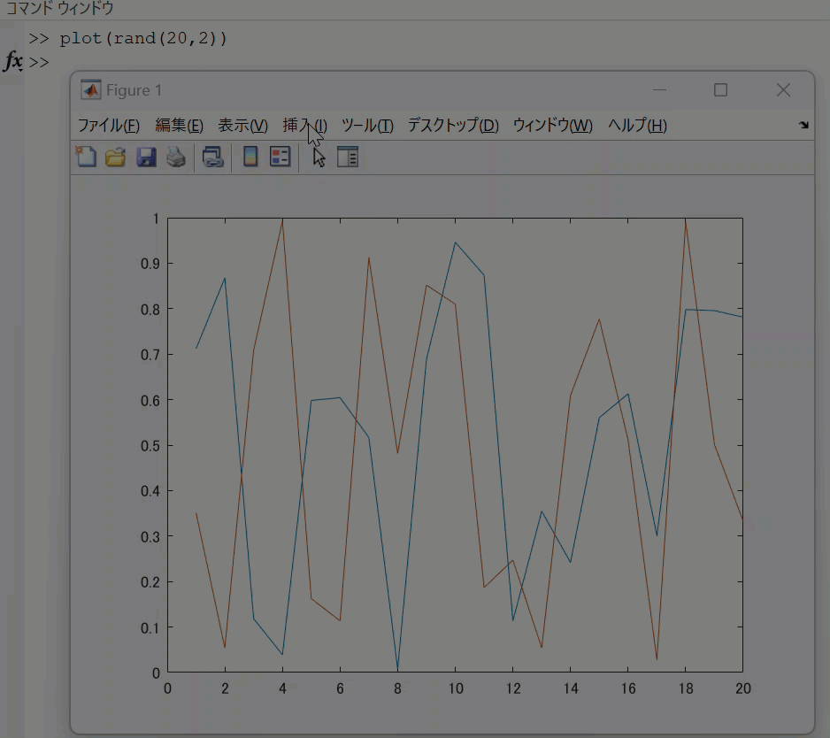
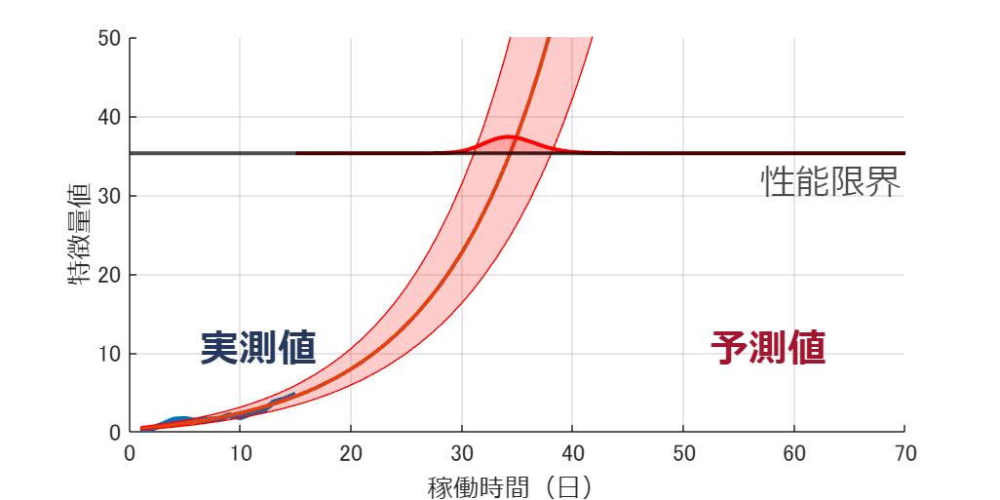

# 寿命予測アニメーションの作り方の細かいところ

Qiita: [グラフ背景色をデータの追加とともに変化させるアニメーション作成](https://qiita.com/eigs/items/51194d8232d0ceb68d6b) でも紹介したこれ。描き方について何度か質問を頂いたのでここでまとめておきます。


この投稿でカバーする内容は以下の通り！

-  文字の追加方法 
-  横線の入れ方 
-  線の間の塗りつぶし方 

**動作環境：R2024a**


背景色の変化については


[「グラフ背景色をデータの追加とともに変化させるアニメーション作成」を R2023a でシンプルに](https://qiita.com/eigs/items/0daa2a5a7e7edcf69be8)


で解説しています。R2023a で導入された [xregion 関数](https://jp.mathworks.com/help/matlab/ref/xregion.html)のおかげで楽になりました。

# まずはこれ

GIF 作成するとなると動作が遅くなるので、必要な時だけ true にするようにしておきます。

```matlab
makeGIF = false;% GIF を作成する場合は true にしてください。
filename = 'RUL_DegredationModel_Sample.gif'; % ファイル名
```
## 使用するデータ

寿命予測のデータはこちらのサンプルで生成されるものを使用します。


mathworks.com: [風力タービン高速ベアリングの経過予測](https://jp.mathworks.com/help/predmaint/ug/wind-turbine-high-speed-bearing-prognosis.html)

```matlab
% データ読み込み
load SampleData.mat
% 以下の変数が読み込まれます
% data: 49x3 table
% healthIndicator: 50x1 double
```

`data` には  `Day, pdfRUL, RULdata` 変数が入っており、それぞれ

-  `Day`: 日付 
-  `pdfRUL`: RUL の確率分布（200x2） 
-  `RULdata`: `HealthIndicator` の予測値と信頼区間のデータ 

です。こんな感じの table 型データです。

```matlab
data
```
| |Day|pdfRUL|RULdata|
|:--:|:--:|:--:|:--:|
|1|1|200x2 table|100x3 table|
|2|2|200x2 table|100x3 table|
|3|3|200x2 table|100x3 table|
|4|4|200x2 table|100x3 table|
|5|5|200x2 table|100x3 table|
|6|6|200x2 table|100x3 table|
|7|7|200x2 table|100x3 table|
|8|8|200x2 table|100x3 table|
|9|9|200x2 table|100x3 table|
|10|10|200x2 table|100x3 table|
|11|11|200x2 table|100x3 table|
|12|12|200x2 table|100x3 table|
|13|13|200x2 table|100x3 table|
|14|14|200x2 table|100x3 table|

```matlab
totalDay = height(data)
```

```matlabTextOutput
totalDay = 49
```

49 日間分の RUL（余寿命, Remaining Useful Life）に関する情報が入っています。

# Figure の設定

文字等が綺麗に表示できるように Figure のサイズ設定しておきます。

```matlab
h_figure = figure(Position=[100 100 1200 600]);
```

座標軸の設定を行います。ここでは Meiryo UI を使用します。

```matlab
h_axes = axes;
ylabel("特徴量値",FontName="Meiryo UI"); % y 軸ラベル
xlabel("稼働時間（日）",FontName="Meiryo UI"); % x 軸ラベル
grid(h_axes,'on'); % grid 表示 on :hold on でも同じ
```

その他座標軸プロパティの設定で、ティックの表示やフォントサイズを指定します。

```matlab
h_axes.FontSize = 12;
h_axes.XTick = [0 10 20 30 40 50 60 70];
h_axes.YTick = [0 10 20 30 40 50];
hold on
```


# 文字の挿入

「実測値」や「予測値」の部分ですね。位置の指定については Figure 上で手動で追加して、コード生成、という方法をよくとります。


こんな感じ





これでざっくり位置が分かるので適当に丸めて、あとはフォントの設定等を加えてます。

## 「実測値」の表示: textbox を作成
```matlab
annotation(h_figure,"textbox",...
    [0.19 0.3 0.16 0.074],...
    Color=[0.15 0.22 0.37],...
    String="実測値",...
    FontWeight="bold",...
    FontSize=20,...
    FontName="Meiryo UI",...
    EdgeColor="none");

```
## 「予測値」の表示: textbox を作成
```matlab
annotation(h_figure,"textbox",...
    [0.7 0.3 0.15 0.074],...
    Color=[0.64 0.078 0.18],...
    String="予測値",...
    FontWeight="bold",...
    FontName="Meiryo UI",...
    FontSize=20,...
    EdgeColor="none");
```


## 「性能限界」線の表示

これは [yline 関数](https://jp.mathworks.com/help/matlab/ref/yline.html) (R2018b から使える関数) が便利です。線の上に載せる文字も一緒に設定可能です。

```matlab
% 性能限界の線
threshold = 35.2868;
yline(threshold,'-k',"性能限界", ...
    LineWidth=2,Color=[0 0 0], ...
    FontSize=18,FontName="Meiryo UI", ...
    LabelVerticalAlignment='bottom');

% 表示範囲指定
xlim([0,70]);
ylim([0,50]);
```


# 初期データを追加します

まず `startDay = 15` 日目までのデータを表示させて様子を見ます。Graphics object の handle (`h_pred` や `h_CI1`) を変数で確保しておき、あとデータの変更・追加等できるようにしておきます。


startDay のデータを取り出す

```matlab
startDay = 15;
HIpred = data.RULdata{startDay}.HIpred;
HIpredCI1 = data.RULdata{startDay}.HIpredCI1;
HIpredCI2 = data.RULdata{startDay}.HIpredCI2;
pdfRUL = data.pdfRUL{startDay};

```

ここから描画開始

```matlab
% healthIndicator (計測値)
h_cond = plot(1:startDay,healthIndicator(1:startDay),...
    Color=[0 0.4470 0.7410],LineWidth=3);
% HIpred: healthIndicator の予測値
h_pred = plot(HIpred,Color=[0.8500 0.3250 0.0980],LineWidth=2);
% 予測値の信頼区間
l1 = plot(HIpredCI1,'r');
l2 = plot(HIpredCI2,'r');
```

信頼区間上下限の間を patch で色塗りします。

```matlab
X = [l1.XData fliplr(l2.XData)];
Y = [l1.YData fliplr(l2.YData)];
pp = patch(X,Y,[1 0 0],FaceAlpha=0.2,EdgeColor='r');
```


確率密度分布を threshold の線の上に描きます。


まず値に threshold を加えたものを描いて、threshold との間を patch で埋めます。

```matlab
lpdf = plot(pdfRUL.RUL+startDay, pdfRUL.ProbabilityDensity*20+threshold,...
    'r',LineWidth=2);
X = [lpdf.XData lpdf.XData(1)];
Y = [lpdf.YData threshold];
pppdf = patch(X,Y,[1 0 0],FaceAlpha=0.2,EdgeColor='r');
```



背景色ですね。

```matlab
% 実測値部分
ha1 = xregion(-inf,startDay,...
    FaceColor=[0.73 0.83 0.95],...
    FaceAlpha=0.2);
% 予測部分
ha2 = xregion(startDay,inf,...
    FaceColor=[0.92 0.84 0.84],...
    FaceAlpha=0.2);
```


# totalDay までデータを逐次変更・追加

残りのをループで回しながら値を変更して、GIF に追加していきます。

```matlab
for currentDay = startDay+1:totalDay
    HIpred = data.RULdata{currentDay}.HIpred;
    HIpredCI1 = data.RULdata{currentDay}.HIpredCI1;
    HIpredCI2 = data.RULdata{currentDay}.HIpredCI2;
    pdfRUL = data.pdfRUL{currentDay};

    % 予測値
    h_pred.YData = HIpred;
    % 信頼区間上下限
    l1.YData = HIpredCI1;
    l2.YData = HIpredCI2;
    % 色塗り
    X = [l1.XData fliplr(l2.XData)];
    Y = [l1.YData fliplr(l2.YData)];
    pp.XData = X;
    pp.YData = Y;
    
    % healthIndicator 
    h_cond.XData = 1:currentDay;
    h_cond.YData = healthIndicator(1:currentDay);

    % RUL 確率密度分布
    lpdf.XData = pdfRUL.RUL+currentDay;
    lpdf.YData = pdfRUL.ProbabilityDensity*20+threshold;
    % 色塗り
    X = [lpdf.XData, lpdf.XData(1)];
    Y = [lpdf.YData, threshold];
    pppdf.XData = X;
    pppdf.YData = Y;

    % 背景色
    ha1.Value(2) = currentDay;
    ha2.Value(1) = currentDay;

    drawnow
    if makeGIF
        frame = getframe(gcf);
        tmp = frame2im(frame);
        [A,map] = rgb2ind(tmp,256);
        if currentDay == startDay
            imwrite(A,map,filename,"gif",LoopCount=Inf,DelayTime=0.2);
        else
            imwrite(A,map,filename,"gif",WriteMode="append",DelayTime=0.2);
        end
    end

end
hold off
```

できあがり！


